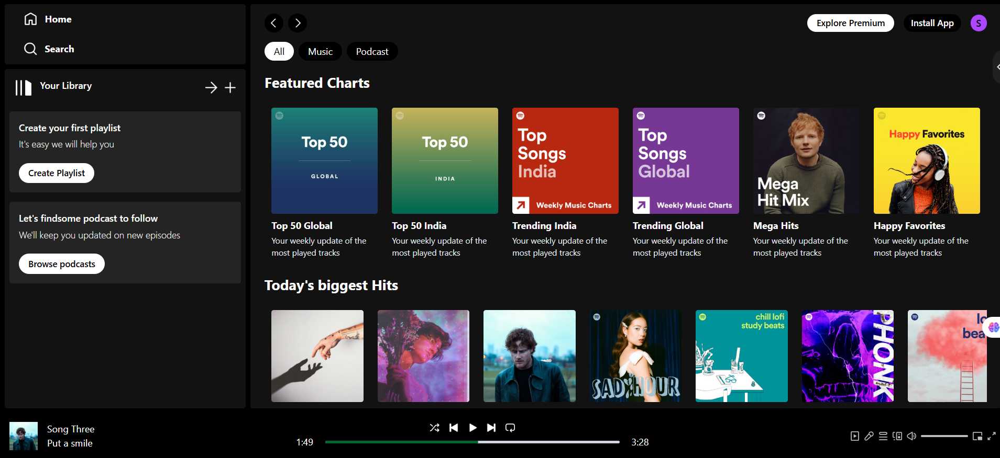

# Spoticlone-A-music-destination
A full stack music web inspired by spotify
🎵 Spoticlone - MERN Stack Music Streaming App
A full-stack Spoticlone built using the MERN Stack (MongoDB, Express, React, Node.js). This app lets users stream music, browse tracks, and enjoy a Spotify-like experience — completely custom and modern.

🖼️ Screenshots

⚙️ Tech Stack
Frontend: React.js, Tailwind CSS, Axios

Backend: Node.js, Express.js

Database: MongoDB (with Mongoose)

📂 Project Structure
bash
Copy
Edit
/client         → Frontend (React)
/server         → Backend (Express + MongoDB)
/README.md
✅ Features
🎧 Play/Pause/Next/Previous

🔍 Home page and track page access

💾 Upload your own tracks (Admin)

🗃️ MongoDB for track & user storage

📱 Responsive design

🎨 Tailwind CSS UI

🛠️ Setup Instructions
1. Clone the repository
bash
Copy
Edit
git clone https://github.com/SrimathiKR/Spoticlone-A-music-destination
cd spotify-clone-mern
2. Setup Frontend (React)
bash
Copy
Edit
cd client
npm install
npm run dev     # Starts on http://localhost:5173
3. Setup Backend (Express)
bash
Copy
Edit
cd ../server
npm install
npm run dev     # Starts on http://localhost:5000
🔐 Environment Variables
Create .env file in /server and add the following:

env
Copy
Edit
PORT=5000
MONGO_URI=your_mongodb_connection_string
JWT_SECRET=your_secret_key
For client, if needed, create .env in /client:

env
Copy
Edit

📌 Future Enhancements
Add user playlists

Like/Dislike tracks

Premium subscription model

Lyrics integration

Spotify API integration

🤝 Contributing
Pull requests are welcome! For major changes, please open an issue first.

📄 License
MIT
